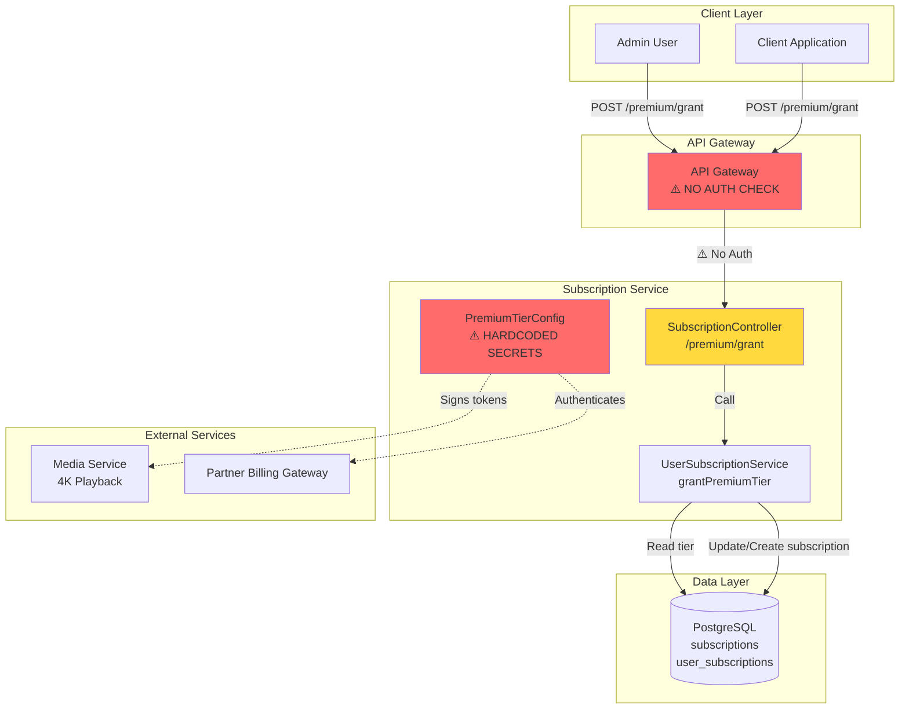
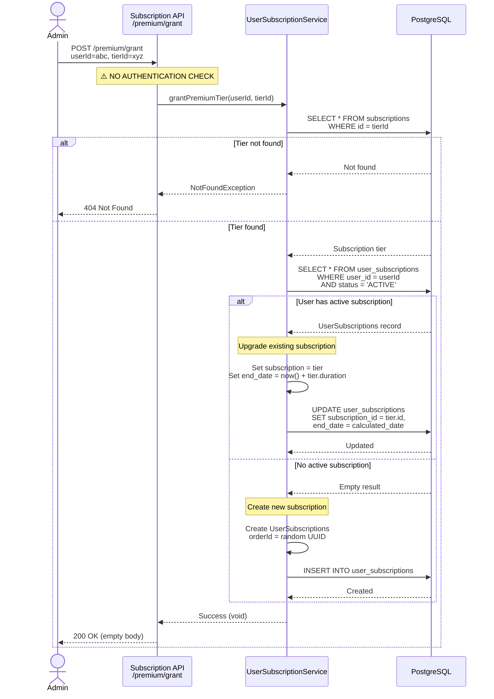
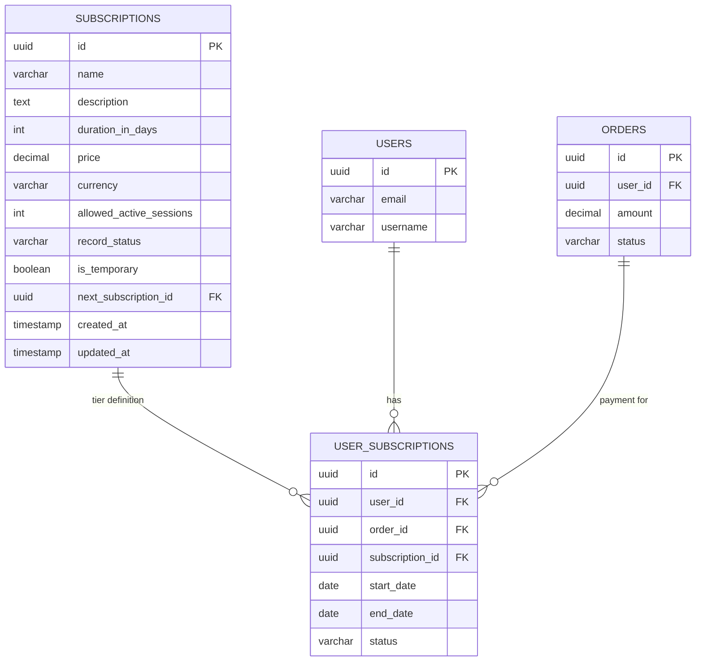
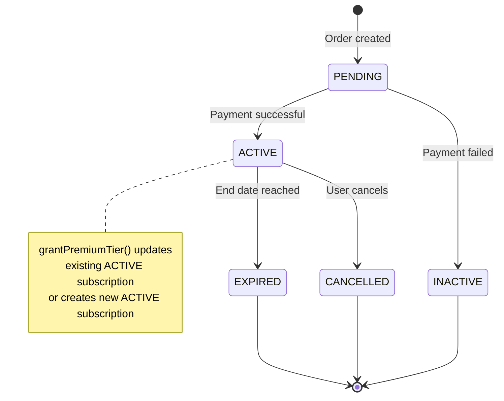
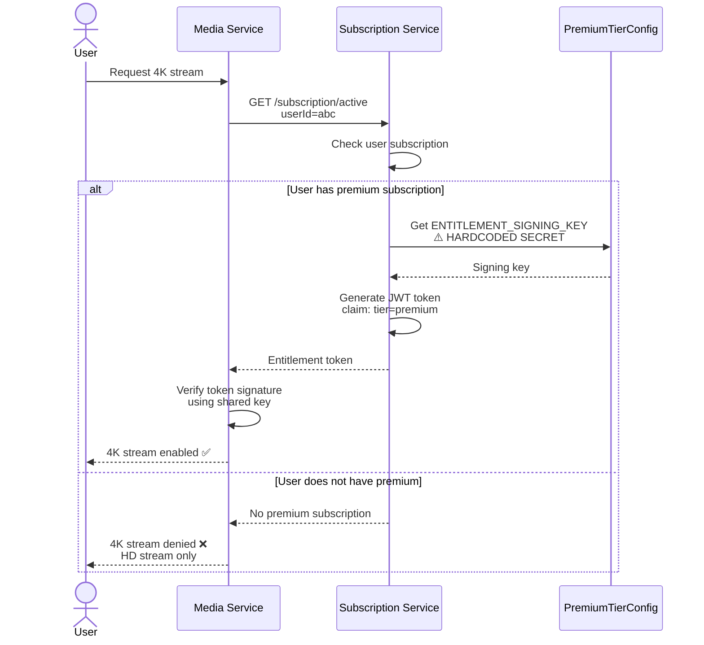
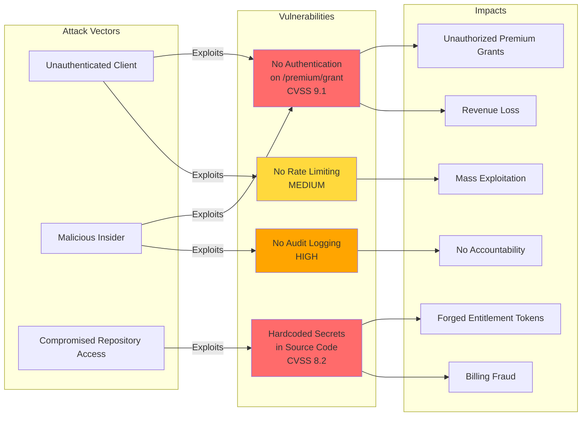
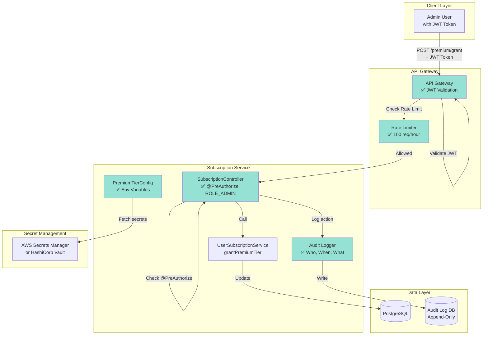
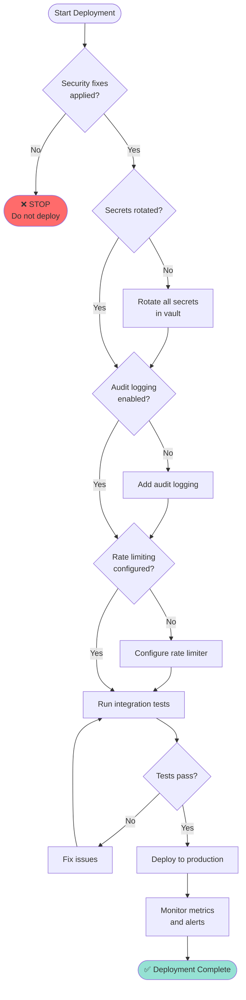
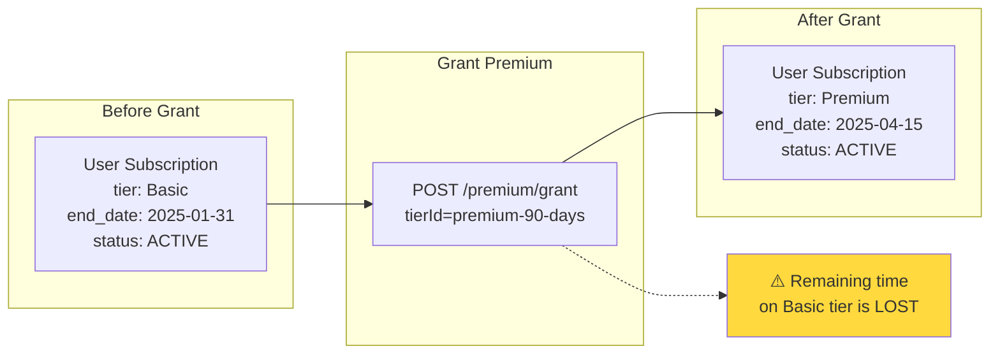
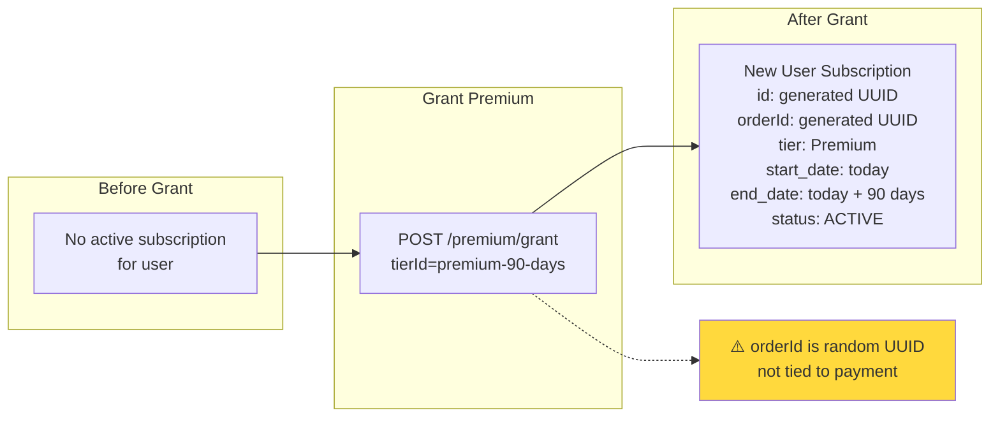

# Premium tier architecture diagrams

This document contains visual diagrams to help understand the premium tier feature's architecture and data flows.

## System architecture

**Legend:**
- 🔴 Red = Critical security issue
- 🟡 Yellow = Warning

---

## Grant premium tier flow

---

## Data model

---

## Subscription status lifecycle

---

## Integration with media service

---

## Current security vulnerabilities

---

## Recommended secure architecture

**Legend:**
- 🟢 Green = Secured component

---

## Deployment flow (with security fixes)

---

## Data flow: Upgrade existing subscription

---

## Data flow: Create new subscription

---

## See also

- [Premium Tier Feature Overview](../PREMIUM_TIER.md)
- [Premium Tier API Reference](./PREMIUM_TIER_API.md)
- [Security Advisory](./PREMIUM_TIER_SECURITY_ADVISORY.md)

---

**Last updated:** 2025-01-15  
**Version:** 1.0
